# ce-skeleton

<!-- Auto Generated Below -->

## Properties

| Property | Attribute | Description      | Type                           | Default   |
| -------- | --------- | ---------------- | ------------------------------ | --------- |
| `effect` | `effect`  | Animation effect | `"none" \| "pulse" \| "sheen"` | `'sheen'` |

## Shadow Parts

| Part          | Description |
| ------------- | ----------- |
| `"base"`      |             |
| `"indicator"` |             |

## CSS Custom Properties

| Name              | Description                                                |
| ----------------- | ---------------------------------------------------------- |
| `--border-radius` | The skeleton's border radius.                              |
| `--color`         | The color of the skeleton.                                 |
| `--sheen-color`   | The sheen color when the skeleton is in its loading state. |

## Dependencies

### Used by

 - [sc-cancel-survey](../../controllers/dashboard/sc-cancel-survey)
 - [sc-charges-list](../../controllers/dashboard/charges-list)
 - [sc-checkout-mollie-payment](../../controllers/checkout-form/sc-checkout-mollie-payment)
 - [sc-coupon-form](../coupon-form)
 - [sc-custom-order-price-input](../../controllers/checkout-form/custom-order-price-input)
 - [sc-customer-details](../customer-details)
 - [sc-donation-choices](../../controllers/checkout-form/donation-choices)
 - [sc-fulfillments](../../controllers/dashboard/fulfillments)
 - [sc-invoice-memo](../../controllers/checkout-form/invoice-memo)
 - [sc-invoices-list](../../controllers/dashboard/invoices-list)
 - [sc-license](../../controllers/dashboard/sc-license)
 - [sc-licenses-list](../../controllers/dashboard/sc-licenses-list)
 - [sc-line-item-invoice-due-date](../../controllers/checkout-form/invoice-due-date)
 - [sc-line-item-invoice-number](../../controllers/checkout-form/invoice-number)
 - [sc-line-item-invoice-receipt-download](../../controllers/checkout-form/invoice-receipt-download)
 - [sc-line-item-shipping](../../controllers/checkout-form/sc-line-item-shipping)
 - [sc-line-item-total](../../controllers/checkout-form/line-item-total)
 - [sc-line-items](../../controllers/checkout-form/line-items)
 - [sc-mollie-add-method](../sc-mollie-add-method)
 - [sc-order](../../controllers/dashboard/order)
 - [sc-order-confirmation-details](../../controllers/confirmation/order-confirmation-details)
 - [sc-order-confirmation-line-items](../../controllers/confirmation/order-confirmation-line-items)
 - [sc-order-detail](../../controllers/confirmation/order-detail)
 - [sc-order-summary](../../controllers/checkout-form/order-summary)
 - [sc-orders-list](../../controllers/dashboard/orders-list)
 - [sc-payment-methods-list](../../controllers/dashboard/payment-methods-list)
 - [sc-paypal-buttons](../paypal-buttons)
 - [sc-price-choice](../../controllers/checkout-form/price-choice)
 - [sc-price-choice-container](../sc-price-choice-container)
 - [sc-product-item-list](../../controllers/products/sc-product-item-list)
 - [sc-purchase-downloads-list](../purchase-downloads-list)
 - [sc-stripe-add-method](../sc-stripe-add-method)
 - [sc-stripe-payment-element](../stripe-payment-element)
 - [sc-subscription](../../controllers/dashboard/subscription)
 - [sc-subscription-cancel](../../controllers/dashboard/subscription-cancel)
 - [sc-subscription-details](../../controllers/dashboard/subscription-details)
 - [sc-subscription-next-payment](../../controllers/dashboard/subscription-details)
 - [sc-subscription-payment](../../controllers/dashboard/subscription-payment)
 - [sc-subscription-payment-method](../../controllers/dashboard/sc-subscription-payment-method)
 - [sc-subscription-reactivate](../../controllers/dashboard/subscription-reactivate)
 - [sc-subscription-switch](../../controllers/dashboard/subscription-switch)
 - [sc-subscriptions-list](../../controllers/dashboard/subscriptions-list)
 - [sc-summary](../sc-summary)
 - [sc-upcoming-invoice](../../controllers/dashboard/upcoming-invoice)

### Graph

```mermaid
graph TD;
  sc-cancel-survey --> sc-skeleton
  sc-charges-list --> sc-skeleton
  sc-checkout-mollie-payment --> sc-skeleton
  sc-coupon-form --> sc-skeleton
  sc-custom-order-price-input --> sc-skeleton
  sc-customer-details --> sc-skeleton
  sc-donation-choices --> sc-skeleton
  sc-fulfillments --> sc-skeleton
  sc-invoice-memo --> sc-skeleton
  sc-invoices-list --> sc-skeleton
  sc-license --> sc-skeleton
  sc-licenses-list --> sc-skeleton
  sc-line-item-invoice-due-date --> sc-skeleton
  sc-line-item-invoice-number --> sc-skeleton
  sc-line-item-invoice-receipt-download --> sc-skeleton
  sc-line-item-shipping --> sc-skeleton
  sc-line-item-total --> sc-skeleton
  sc-line-items --> sc-skeleton
  sc-mollie-add-method --> sc-skeleton
  sc-order --> sc-skeleton
  sc-order-confirmation-details --> sc-skeleton
  sc-order-confirmation-line-items --> sc-skeleton
  sc-order-detail --> sc-skeleton
  sc-order-summary --> sc-skeleton
  sc-orders-list --> sc-skeleton
  sc-payment-methods-list --> sc-skeleton
  sc-paypal-buttons --> sc-skeleton
  sc-price-choice --> sc-skeleton
  sc-price-choice-container --> sc-skeleton
  sc-product-item-list --> sc-skeleton
  sc-purchase-downloads-list --> sc-skeleton
  sc-stripe-add-method --> sc-skeleton
  sc-stripe-payment-element --> sc-skeleton
  sc-subscription --> sc-skeleton
  sc-subscription-cancel --> sc-skeleton
  sc-subscription-details --> sc-skeleton
  sc-subscription-next-payment --> sc-skeleton
  sc-subscription-payment --> sc-skeleton
  sc-subscription-payment-method --> sc-skeleton
  sc-subscription-reactivate --> sc-skeleton
  sc-subscription-switch --> sc-skeleton
  sc-subscriptions-list --> sc-skeleton
  sc-summary --> sc-skeleton
  sc-upcoming-invoice --> sc-skeleton
  style sc-skeleton fill:#f9f,stroke:#333,stroke-width:4px
```

----------------------------------------------

*Built with [StencilJS](https://stenciljs.com/)*
