# ce-skeleton

<!-- Auto Generated Below -->

## Properties

| Property | Attribute | Description      | Type                           | Default   |
| -------- | --------- | ---------------- | ------------------------------ | --------- |
| `effect` | `effect`  | Animation effect | `"none" \| "pulse" \| "sheen"` | `'sheen'` |

## Shadow Parts

| Part          | Description |
| ------------- | ----------- |
| `"base"`      |             |
| `"indicator"` |             |

## CSS Custom Properties

| Name              | Description                                                |
| ----------------- | ---------------------------------------------------------- |
| `--border-radius` | The skeleton's border radius.                              |
| `--color`         | The color of the skeleton.                                 |
| `--sheen-color`   | The sheen color when the skeleton is in its loading state. |

## Dependencies

### Used by

 - [ce-address](../ce-address)
 - [ce-card](../card)
 - [ce-charges-list](../../controllers/dashboard/charges-list)
 - [ce-coupon-form](../../controllers/coupon-form)
 - [ce-customer-orders-list](../../controllers/dashboard/customer-orders-list)
 - [ce-customer-subscription-edit](../../controllers/dashboard/subscription-detail)
 - [ce-customer-subscription-plan](../../controllers/dashboard/subscription-plan)
 - [ce-line-item-total](../../controllers/line-item-total)
 - [ce-line-items](../../controllers/line-items)
 - [ce-order-confirmation-line-items](../../controllers/order-confirmation-line-items)
 - [ce-order-detail](../../controllers/dashboard/order-detail)
 - [ce-order-summary](../../controllers/order-summary)
 - [ce-orders-list](../../controllers/dashboard/orders-list)
 - [ce-payment](../../controllers/payment)
 - [ce-payment-methods-list](../../controllers/dashboard/payment-methods-list)
 - [ce-price-choice](../../controllers/price-choice)
 - [ce-session-detail](../../controllers/session-detail)
 - [ce-subscriptions-list](../../controllers/dashboard/subscriptions-list)

### Graph

```mermaid
graph TD;
  ce-address --> ce-skeleton
  ce-card --> ce-skeleton
  ce-charges-list --> ce-skeleton
  ce-coupon-form --> ce-skeleton
  ce-customer-orders-list --> ce-skeleton
  ce-customer-subscription-edit --> ce-skeleton
  ce-customer-subscription-plan --> ce-skeleton
  ce-line-item-total --> ce-skeleton
  ce-line-items --> ce-skeleton
  ce-order-confirmation-line-items --> ce-skeleton
  ce-order-detail --> ce-skeleton
  ce-order-summary --> ce-skeleton
  ce-orders-list --> ce-skeleton
  ce-payment --> ce-skeleton
  ce-payment-methods-list --> ce-skeleton
  ce-price-choice --> ce-skeleton
  ce-session-detail --> ce-skeleton
  ce-subscriptions-list --> ce-skeleton
  style ce-skeleton fill:#f9f,stroke:#333,stroke-width:4px
```

----------------------------------------------

*Built with [StencilJS](https://stenciljs.com/)*
