# ce-skeleton

<!-- Auto Generated Below -->

## Properties

| Property | Attribute | Description      | Type                           | Default   |
| -------- | --------- | ---------------- | ------------------------------ | --------- |
| `effect` | `effect`  | Animation effect | `"none" \| "pulse" \| "sheen"` | `'sheen'` |

## Shadow Parts

| Part          | Description |
| ------------- | ----------- |
| `"base"`      |             |
| `"indicator"` |             |

## CSS Custom Properties

| Name              | Description                                                |
| ----------------- | ---------------------------------------------------------- |
| `--border-radius` | The skeleton's border radius.                              |
| `--color`         | The color of the skeleton.                                 |
| `--sheen-color`   | The sheen color when the skeleton is in its loading state. |

## Dependencies

### Used by

 - [ce-charges-list](../../controllers/dashboard/charges-list)
 - [ce-coupon-form](../coupon-form)
 - [ce-customer-details](../customer-details)
 - [ce-donation-choices](../../controllers/checkout-form/ce-donation-choices)
 - [ce-downloads-list](../downloads-list)
 - [ce-invoices-list](../../controllers/dashboard/invoices-list)
 - [ce-line-item-total](../../controllers/checkout-form/line-item-total)
 - [ce-line-items](../../controllers/checkout-form/line-items)
 - [ce-order-confirmation-line-items](../../controllers/confirmation/order-confirmation-line-items)
 - [ce-order-detail](../../controllers/confirmation/order-detail)
 - [ce-order-summary](../../controllers/checkout-form/order-summary)
 - [ce-orders-list](../../controllers/dashboard/orders-list)
 - [ce-payment](../../controllers/checkout-form/payment)
 - [ce-payment-methods-list](../../controllers/dashboard/payment-methods-list)
 - [ce-price-choice](../../controllers/checkout-form/price-choice)
 - [ce-subscription](../../controllers/dashboard/subscription)
 - [ce-subscription-cancel](../../controllers/dashboard/subscription-cancel)
 - [ce-subscription-details](../../controllers/dashboard/subscription-details)
 - [ce-subscription-payment](../../controllers/dashboard/subscription-payment)
 - [ce-subscription-renew](../../controllers/dashboard/subscription-renew)
 - [ce-subscription-switch](../../controllers/dashboard/subscription-switch)
 - [ce-subscriptions-list](../../controllers/dashboard/subscriptions-list)
 - [ce-upcoming-invoice](../../controllers/dashboard/upcoming-invoice)

### Graph

```mermaid
graph TD;
  ce-charges-list --> ce-skeleton
  ce-coupon-form --> ce-skeleton
  ce-customer-details --> ce-skeleton
  ce-donation-choices --> ce-skeleton
  ce-downloads-list --> ce-skeleton
  ce-invoices-list --> ce-skeleton
  ce-line-item-total --> ce-skeleton
  ce-line-items --> ce-skeleton
  ce-order-confirmation-line-items --> ce-skeleton
  ce-order-detail --> ce-skeleton
  ce-order-summary --> ce-skeleton
  ce-orders-list --> ce-skeleton
  ce-payment --> ce-skeleton
  ce-payment-methods-list --> ce-skeleton
  ce-price-choice --> ce-skeleton
  ce-subscription --> ce-skeleton
  ce-subscription-cancel --> ce-skeleton
  ce-subscription-details --> ce-skeleton
  ce-subscription-payment --> ce-skeleton
  ce-subscription-renew --> ce-skeleton
  ce-subscription-switch --> ce-skeleton
  ce-subscriptions-list --> ce-skeleton
  ce-upcoming-invoice --> ce-skeleton
  style ce-skeleton fill:#f9f,stroke:#333,stroke-width:4px
```

----------------------------------------------

*Built with [StencilJS](https://stenciljs.com/)*
