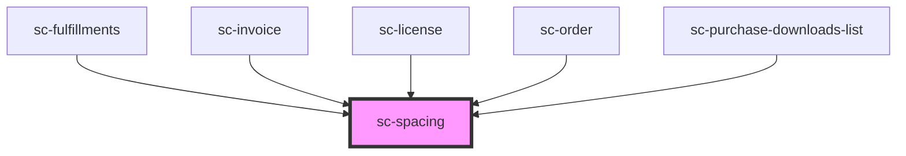

# ce-spacing

<!-- Auto Generated Below -->

## Dependencies

### Used by

 - [sc-fulfillments](../../controllers/dashboard/fulfillments)
 - [sc-invoice](../../controllers/dashboard/invoice)
 - [sc-license](../../controllers/dashboard/sc-license)
 - [sc-order](../../controllers/dashboard/order)
 - [sc-purchase-downloads-list](../purchase-downloads-list)

### Graph

----------------------------------------------

*Built with [StencilJS](https://stenciljs.com/)*
