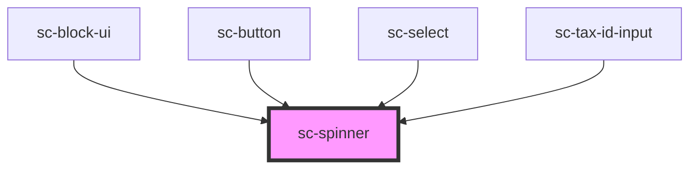

# ce-spinner

<!-- Auto Generated Below -->

## Shadow Parts

| Part     | Description |
| -------- | ----------- |
| `"base"` |             |

## CSS Custom Properties

| Name                | Description                           |
| ------------------- | ------------------------------------- |
| `--indicator-color` | The color of the spinner's indicator. |
| `--stroke-width`    | The width of the indicator.           |
| `--track-color`     | The color of the spinner's track.     |

## Dependencies

### Used by

 - [sc-block-ui](../block-ui)
 - [sc-button](../button)
 - [sc-select](../select)
 - [sc-tax-id-input](../tax-id-input)

### Graph

----------------------------------------------

*Built with [StencilJS](https://stenciljs.com/)*
