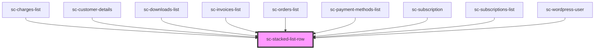

# ce-stacked-list-row

<!-- Auto Generated Below -->

## Properties

| Property     | Attribute     | Description | Type     | Default     |
| ------------ | ------------- | ----------- | -------- | ----------- |
| `href`       | `href`        |             | `string` | `undefined` |
| `mobileSize` | `mobile-size` |             | `number` | `600`       |
| `target`     | `target`      |             | `string` | `'_self'`   |

## Dependencies

### Used by

 - [sc-charges-list](../../controllers/dashboard/charges-list)
 - [sc-customer-details](../customer-details)
 - [sc-downloads-list](../downloads-list)
 - [sc-invoices-list](../../controllers/dashboard/invoices-list)
 - [sc-orders-list](../../controllers/dashboard/orders-list)
 - [sc-payment-methods-list](../../controllers/dashboard/payment-methods-list)
 - [sc-subscription](../../controllers/dashboard/subscription)
 - [sc-subscriptions-list](../../controllers/dashboard/subscriptions-list)
 - [sc-wordpress-user](../../controllers/dashboard/wordpress-user)

### Graph

----------------------------------------------

*Built with [StencilJS](https://stenciljs.com/)*
