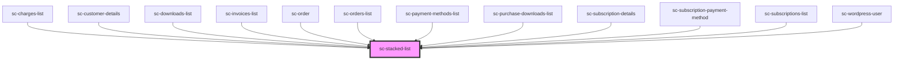

# ce-stacked-list

<!-- Auto Generated Below -->

## Dependencies

### Used by

 - [sc-charges-list](../../controllers/dashboard/charges-list)
 - [sc-customer-details](../customer-details)
 - [sc-downloads-list](../../controllers/dashboard/sc-downloads-list)
 - [sc-invoices-list](../../controllers/dashboard/invoices-list)
 - [sc-order](../../controllers/dashboard/order)
 - [sc-orders-list](../../controllers/dashboard/orders-list)
 - [sc-payment-methods-list](../../controllers/dashboard/payment-methods-list)
 - [sc-purchase-downloads-list](../purchase-downloads-list)
 - [sc-subscription-details](../../controllers/dashboard/subscription-details)
 - [sc-subscription-payment-method](../../controllers/dashboard/sc-subscription-payment-method)
 - [sc-subscriptions-list](../../controllers/dashboard/subscriptions-list)
 - [sc-wordpress-user](../../controllers/dashboard/wordpress-user)

### Graph

----------------------------------------------

*Built with [StencilJS](https://stenciljs.com/)*
