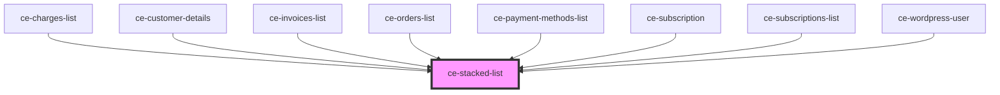

# ce-stacked-list

<!-- Auto Generated Below -->

## Dependencies

### Used by

 - [ce-charges-list](../../controllers/dashboard/charges-list)
 - [ce-customer-details](../../controllers/dashboard/customer-details)
 - [ce-invoices-list](../../controllers/dashboard/invoices-list)
 - [ce-orders-list](../../controllers/dashboard/orders-list)
 - [ce-payment-methods-list](../../controllers/dashboard/payment-methods-list)
 - [ce-subscription](../../controllers/dashboard/subscription)
 - [ce-subscriptions-list](../../controllers/dashboard/subscriptions-list)
 - [ce-wordpress-user](../../controllers/dashboard/wordpress-user)

### Graph

----------------------------------------------

*Built with [StencilJS](https://stenciljs.com/)*
