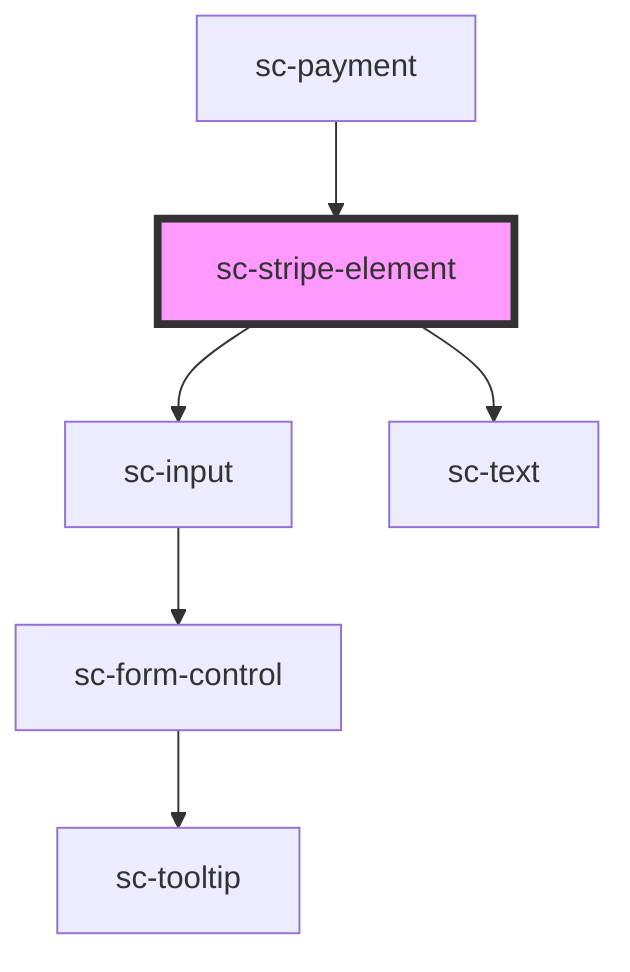

# ce-stripe-element

<!-- Auto Generated Below -->

## Properties

| Property         | Attribute         | Description                                                           | Type                             | Default     |
| ---------------- | ----------------- | --------------------------------------------------------------------- | -------------------------------- | ----------- |
| `accountId`      | `account-id`      | Your stripe connected account id.                                     | `string`                         | `undefined` |
| `disabled`       | `disabled`        | Whether this field is disabled                                        | `boolean`                        | `undefined` |
| `hasFocus`       | `has-focus`       | Inputs focus                                                          | `boolean`                        | `undefined` |
| `label`          | `label`           | The input's label. Alternatively, you can use the label slot.         | `string`                         | `undefined` |
| `mode`           | `mode`            | Mode for the payment                                                  | `"live" \| "test"`               | `'live'`    |
| `order`          | --                | The checkout session object for finalizing intents                    | `Checkout`                       | `undefined` |
| `publishableKey` | `publishable-key` | Stripe publishable key                                                | `string`                         | `undefined` |
| `secureText`     | `secure-text`     | The input's help text. Alternatively, you can use the help-text slot. | `string`                         | `''`        |
| `showLabel`      | `show-label`      | Should we show the label                                              | `boolean`                        | `true`      |
| `size`           | `size`            | The input's size.                                                     | `"large" \| "medium" \| "small"` | `'medium'`  |

## Events

| Event        | Description | Type                |
| ------------ | ----------- | ------------------- |
| `scPaid`     |             | `CustomEvent<void>` |
| `scPayError` |             | `CustomEvent<any>`  |

## Methods

### `confirmCardPayment(secret: any) => Promise<any>`

Confirm card payment

#### Returns

Type: `Promise<any>`

### `confirmCardSetup(secret: any) => Promise<any>`

Confirm card setup.

#### Returns

Type: `Promise<any>`

## Dependencies

### Used by

 - [sc-payment](../../controllers/checkout-form/payment)

### Depends on

- [sc-input](../input)
- [sc-text](../text)

### Graph

----------------------------------------------

*Built with [StencilJS](https://stenciljs.com/)*
