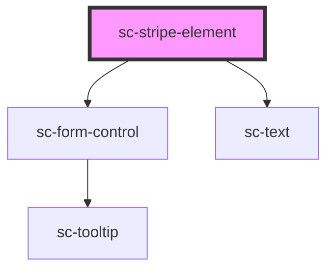

# ce-stripe-element

<!-- Auto Generated Below -->

## Properties

| Property              | Attribute               | Description                                                           | Type                                                                                                                                                           | Default     |
| --------------------- | ----------------------- | --------------------------------------------------------------------- | -------------------------------------------------------------------------------------------------------------------------------------------------------------- | ----------- |
| `disabled`            | `disabled`              | Whether this field is disabled                                        | `boolean`                                                                                                                                                      | `undefined` |
| `formState`           | `form-state`            | The form state                                                        | `"confirmed" \| "confirming" \| "draft" \| "expired" \| "failure" \| "finalizing" \| "idle" \| "loading" \| "paid" \| "paying" \| "redirecting" \| "updating"` | `undefined` |
| `hasFocus`            | `has-focus`             | Inputs focus                                                          | `boolean`                                                                                                                                                      | `undefined` |
| `label`               | `label`                 | The input's label. Alternatively, you can use the label slot.         | `string`                                                                                                                                                       | `undefined` |
| `mode`                | `mode`                  | Mode for the payment                                                  | `"live" \| "test"`                                                                                                                                             | `'live'`    |
| `order`               | --                      | The checkout session object for finalizing intents                    | `Checkout`                                                                                                                                                     | `undefined` |
| `secureText`          | `secure-text`           | The input's help text. Alternatively, you can use the help-text slot. | `string`                                                                                                                                                       | `''`        |
| `selectedProcessorId` | `selected-processor-id` | The selected processor id                                             | `"paypal" \| "paypal-card" \| "stripe"`                                                                                                                        | `undefined` |
| `showLabel`           | `show-label`            | Should we show the label                                              | `boolean`                                                                                                                                                      | `true`      |
| `size`                | `size`                  | The input's size.                                                     | `"large" \| "medium" \| "small"`                                                                                                                               | `'medium'`  |

## Events

| Event        | Description   | Type                                                                                            |
| ------------ | ------------- | ----------------------------------------------------------------------------------------------- |
| `scPaid`     |               | `CustomEvent<void>`                                                                             |
| `scPayError` |               | `CustomEvent<any>`                                                                              |
| `scSetState` | Set the state | `CustomEvent<"EXPIRE" \| "FETCH" \| "FINALIZE" \| "PAID" \| "PAYING" \| "REJECT" \| "RESOLVE">` |

## Methods

### `confirmCardPayment(secret: any) => Promise<any>`

Confirm card payment

#### Returns

Type: `Promise<any>`

### `confirmCardSetup(secret: any) => Promise<any>`

Confirm card setup.

#### Returns

Type: `Promise<any>`

## Dependencies

### Depends on

- [sc-form-control](../form-control)
- [sc-text](../text)

### Graph

----------------------------------------------

*Built with [StencilJS](https://stenciljs.com/)*
