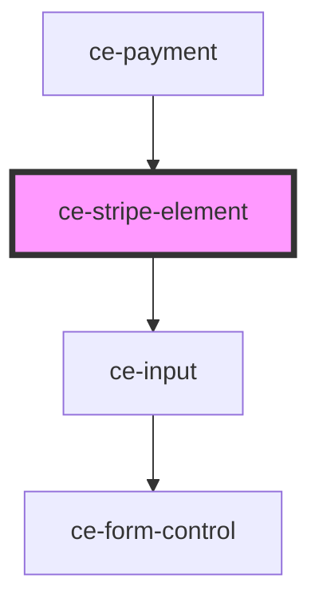

# ce-stripe-element

<!-- Auto Generated Below -->

## Properties

| Property          | Attribute           | Description                                                           | Type                             | Default     |
| ----------------- | ------------------- | --------------------------------------------------------------------- | -------------------------------- | ----------- |
| `checkoutSession` | --                  | The checkout session object for finalizing intents                    | `CheckoutSession`                | `undefined` |
| `hasFocus`        | `has-focus`         | Inputs focus                                                          | `boolean`                        | `undefined` |
| `help`            | `help`              | The input's help text. Alternatively, you can use the help-text slot. | `string`                         | `''`        |
| `label`           | `label`             | The input's label. Alternatively, you can use the label slot.         | `string`                         | `undefined` |
| `publishableKey`  | `publishable-key`   | Stripe publishable key                                                | `string`                         | `undefined` |
| `showLabel`       | `show-label`        | Should we show the label                                              | `boolean`                        | `true`      |
| `size`            | `size`              | The input's size.                                                     | `"large" \| "medium" \| "small"` | `'medium'`  |
| `stripeAccountId` | `stripe-account-id` | Your stripe connected account id.                                     | `string`                         | `undefined` |

## Dependencies

### Used by

 - [ce-payment](../../controllers/payment)

### Depends on

- [ce-input](../input)

### Graph

----------------------------------------------

*Built with [StencilJS](https://stenciljs.com/)*
