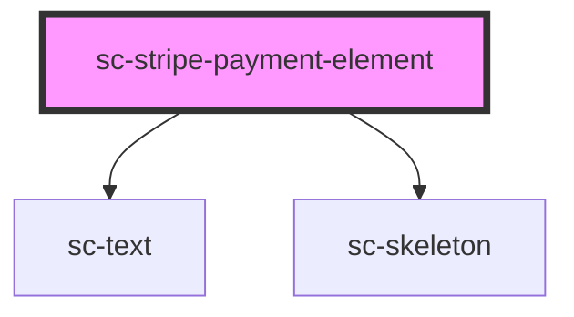

# sc-stripe-payment-element

<!-- Auto Generated Below -->

## Properties

| Property              | Attribute     | Description                   | Type            | Default     |
| --------------------- | ------------- | ----------------------------- | --------------- | ----------- |
| `address`             | `address`     | Should we collect an address? | `boolean`       | `undefined` |
| `order`               | --            | Order to watch                | `Checkout`      | `undefined` |
| `stripePaymentIntent` | --            | The Payment Intent            | `PaymentIntent` | `undefined` |
| `successUrl`          | `success-url` | Success url to redirect.      | `string`        | `undefined` |

## Events

| Event        | Description                     | Type                                                                                            |
| ------------ | ------------------------------- | ----------------------------------------------------------------------------------------------- |
| `scPaid`     | The order/invoice was paid for. | `CustomEvent<void>`                                                                             |
| `scPayError` | There was a payment error.      | `CustomEvent<any>`                                                                              |
| `scSetState` | Set the state                   | `CustomEvent<"EXPIRE" \| "FETCH" \| "FINALIZE" \| "PAID" \| "PAYING" \| "REJECT" \| "RESOLVE">` |

## Methods

### `confirm(type: any, args?: {}) => Promise<void>`

#### Returns

Type: `Promise<void>`

## Dependencies

### Depends on

- [sc-text](../text)
- [sc-skeleton](../skeleton)

### Graph

----------------------------------------------

*Built with [StencilJS](https://stenciljs.com/)*
