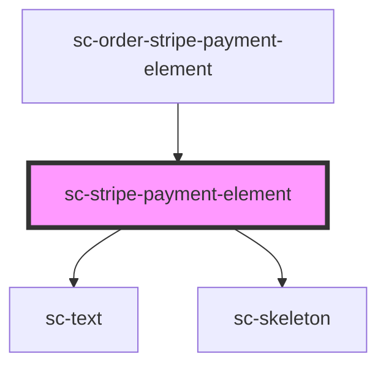

# sc-stripe-payment-element

<!-- Auto Generated Below -->

## Properties

| Property         | Attribute         | Description                                     | Type               | Default     |
| ---------------- | ----------------- | ----------------------------------------------- | ------------------ | ----------- |
| `accountId`      | `account-id`      | The account id.                                 | `string`           | `undefined` |
| `address`        | `address`         | Should we collect an address?                   | `boolean`          | `undefined` |
| `clientSecret`   | `client-secret`   | The client secret to render the payment element | `string`           | `undefined` |
| `order`          | --                | Order to watch                                  | `Invoice \| Order` | `undefined` |
| `publishableKey` | `publishable-key` | The stripe publishable key.                     | `string`           | `undefined` |
| `successUrl`     | `success-url`     | Success url to redirect.                        | `string`           | `undefined` |

## Events

| Event        | Description                     | Type                |
| ------------ | ------------------------------- | ------------------- |
| `scPaid`     | The order/invoice was paid for. | `CustomEvent<void>` |
| `scPayError` | There was a payment error.      | `CustomEvent<any>`  |

## Methods

### `confirm(type: any, args?: {}) => Promise<void>`

#### Returns

Type: `Promise<void>`

## Dependencies

### Used by

 - [sc-order-stripe-payment-element](../../controllers/checkout-form/sc-order-stripe-payment-element)

### Depends on

- [sc-text](../text)
- [sc-skeleton](../skeleton)

### Graph

----------------------------------------------

*Built with [StencilJS](https://stenciljs.com/)*
