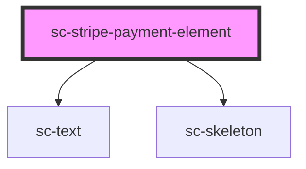

# sc-stripe-payment-element

<!-- Auto Generated Below -->

## Events

| Event                | Description                     | Type                                                                                            |
| -------------------- | ------------------------------- | ----------------------------------------------------------------------------------------------- |
| `scPaid`             | The order/invoice was paid for. | `CustomEvent<void>`                                                                             |
| `scPayError`         | There was a payment error.      | `CustomEvent<any>`                                                                              |
| `scPaymentInfoAdded` | Payment information was added   | `CustomEvent<PaymentInfoAddedParams>`                                                           |
| `scSetState`         | Set the state                   | `CustomEvent<"EXPIRE" \| "FETCH" \| "FINALIZE" \| "PAID" \| "PAYING" \| "REJECT" \| "RESOLVE">` |

## Methods

### `confirm(type: any, args?: {}) => Promise<void>`

#### Returns

Type: `Promise<void>`

## Dependencies

### Depends on

- [sc-text](../text)
- [sc-skeleton](../skeleton)

### Graph

----------------------------------------------

*Built with [StencilJS](https://stenciljs.com/)*
