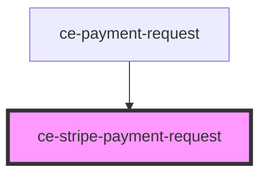

# ce-stripe-payment-request

<!-- Auto Generated Below -->

## Properties

| Property          | Attribute           | Description            | Type                                                                                                                                                                                                                                                                                                                                                                                                                                                              | Default                 |
| ----------------- | ------------------- | ---------------------- | ----------------------------------------------------------------------------------------------------------------------------------------------------------------------------------------------------------------------------------------------------------------------------------------------------------------------------------------------------------------------------------------------------------------------------------------------------------------- | ----------------------- |
| `amount`          | `amount`            | Amount                 | `number`                                                                                                                                                                                                                                                                                                                                                                                                                                                          | `0`                     |
| `checkoutSession` | --                  | Checkout Session       | `CheckoutSession`                                                                                                                                                                                                                                                                                                                                                                                                                                                 | `undefined`             |
| `country`         | `country`           | Country                | `string`                                                                                                                                                                                                                                                                                                                                                                                                                                                          | `'US'`                  |
| `currencyCode`    | `currency-code`     | Currency               | `string`                                                                                                                                                                                                                                                                                                                                                                                                                                                          | `'usd'`                 |
| `keys`            | --                  | Stripe publishable key | `Keys`                                                                                                                                                                                                                                                                                                                                                                                                                                                            | `{     stripe: '',   }` |
| `label`           | `label`             | Label                  | `string`                                                                                                                                                                                                                                                                                                                                                                                                                                                          | `'total'`               |
| `prices`          | --                  |                        | `{ [id: string]: { id: string; name: string; description?: string; amount: number; currency: string; recurring: boolean; recurring_interval?: "day" \| "week" \| "month" \| "year"; recurring_interval_count?: number; ad_hoc: boolean; ad_hoc_max_amount: number; ad_hoc_min_amount: number; archived: boolean; product_id?: string; archived_at?: string; created_at: number; updated_at: number; product?: string; metadata: { [key: string]: string; }; }; }` | `undefined`             |
| `stripeAccountId` | `stripe-account-id` | Stripe account id      | `string`                                                                                                                                                                                                                                                                                                                                                                                                                                                          | `undefined`             |
| `theme`           | `theme`             | Payment request theme  | `string`                                                                                                                                                                                                                                                                                                                                                                                                                                                          | `'dark'`                |

## Events

| Event                    | Description | Type               |
| ------------------------ | ----------- | ------------------ |
| `ceFormSubmit`           |             | `CustomEvent<any>` |
| `ceUpdateBillingAddress` |             | `CustomEvent<any>` |

## Shadow Parts

| Part       | Description |
| ---------- | ----------- |
| `"button"` |             |
| `"or"`     |             |

## Dependencies

### Used by

 - [ce-payment-request](../../controllers/payment-request)

### Graph

----------------------------------------------

*Built with [StencilJS](https://stenciljs.com/)*
