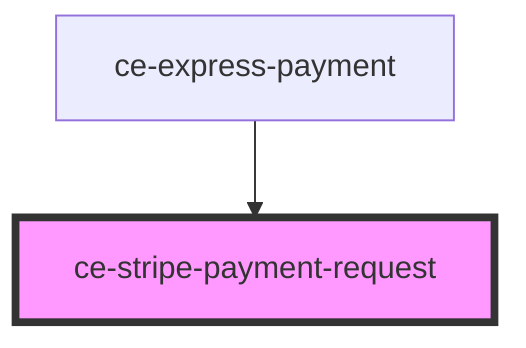

# ce-stripe-payment-request

<!-- Auto Generated Below -->

## Properties

| Property          | Attribute           | Description                                         | Type                                                                                                                                                                                                                                                                                                                                                                                                                                                              | Default     |
| ----------------- | ------------------- | --------------------------------------------------- | ----------------------------------------------------------------------------------------------------------------------------------------------------------------------------------------------------------------------------------------------------------------------------------------------------------------------------------------------------------------------------------------------------------------------------------------------------------------- | ----------- |
| `amount`          | `amount`            | Amount                                              | `number`                                                                                                                                                                                                                                                                                                                                                                                                                                                          | `0`         |
| `country`         | `country`           | Country                                             | `string`                                                                                                                                                                                                                                                                                                                                                                                                                                                          | `'US'`      |
| `currencyCode`    | `currency-code`     | Currency                                            | `string`                                                                                                                                                                                                                                                                                                                                                                                                                                                          | `'usd'`     |
| `error`           | --                  |                                                     | `ResponseError`                                                                                                                                                                                                                                                                                                                                                                                                                                                   | `undefined` |
| `formId`          | `form-id`           | This is required to validate the form on the server | `number \| string`                                                                                                                                                                                                                                                                                                                                                                                                                                                | `undefined` |
| `label`           | `label`             | Label                                               | `string`                                                                                                                                                                                                                                                                                                                                                                                                                                                          | `'total'`   |
| `order`           | --                  | Checkout Session                                    | `Order`                                                                                                                                                                                                                                                                                                                                                                                                                                                           | `undefined` |
| `paymentMethod`   | `payment-method`    |                                                     | `string`                                                                                                                                                                                                                                                                                                                                                                                                                                                          | `undefined` |
| `prices`          | --                  |                                                     | `{ [id: string]: { id: string; name: string; description?: string; amount: number; currency: string; recurring: boolean; recurring_interval?: "day" \| "week" \| "month" \| "year"; recurring_interval_count?: number; ad_hoc: boolean; ad_hoc_max_amount: number; ad_hoc_min_amount: number; archived: boolean; product_id?: string; archived_at?: string; created_at: number; updated_at: number; product?: string; metadata: { [key: string]: string; }; }; }` | `undefined` |
| `publishableKey`  | `publishable-key`   | Stripe publishable key                              | `string`                                                                                                                                                                                                                                                                                                                                                                                                                                                          | `undefined` |
| `stripeAccountId` | `stripe-account-id` | Your stripe connected account id.                   | `string`                                                                                                                                                                                                                                                                                                                                                                                                                                                          | `undefined` |
| `theme`           | `theme`             | Payment request theme                               | `string`                                                                                                                                                                                                                                                                                                                                                                                                                                                          | `'dark'`    |

## Events

| Event                    | Description | Type                  |
| ------------------------ | ----------- | --------------------- |
| `ceFormSubmit`           |             | `CustomEvent<any>`    |
| `cePaid`                 |             | `CustomEvent<void>`   |
| `cePayError`             |             | `CustomEvent<any>`    |
| `cePaymentRequestLoaded` |             | `CustomEvent<void>`   |
| `ceSetState`             |             | `CustomEvent<string>` |

## Shadow Parts

| Part       | Description |
| ---------- | ----------- |
| `"button"` |             |

## Dependencies

### Used by

 - [ce-express-payment](../../controllers/express-payment)

### Graph

----------------------------------------------

*Built with [StencilJS](https://stenciljs.com/)*
