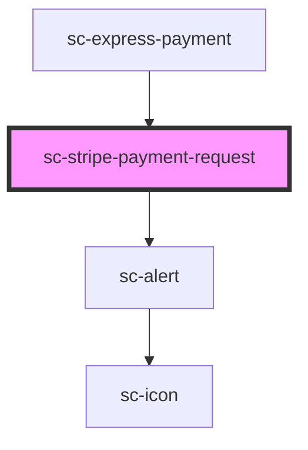

# ce-stripe-payment-request

<!-- Auto Generated Below -->

## Properties

| Property          | Attribute           | Description                                         | Type                       | Default     |
| ----------------- | ------------------- | --------------------------------------------------- | -------------------------- | ----------- |
| `amount`          | `amount`            | Amount                                              | `number`                   | `0`         |
| `country`         | `country`           | Country                                             | `string`                   | `'US'`      |
| `currencyCode`    | `currency-code`     | Currency                                            | `string`                   | `'usd'`     |
| `debug`           | `debug`             | Is this in debug mode.                              | `boolean`                  | `false`     |
| `error`           | --                  |                                                     | `ResponseError`            | `undefined` |
| `formId`          | `form-id`           | This is required to validate the form on the server | `number \| string`         | `undefined` |
| `label`           | `label`             | Label                                               | `string`                   | `'total'`   |
| `order`           | --                  | Checkout Session                                    | `Checkout`                 | `undefined` |
| `paymentMethod`   | `payment-method`    |                                                     | `string`                   | `undefined` |
| `prices`          | --                  |                                                     | `{ [id: string]: Price; }` | `undefined` |
| `publishableKey`  | `publishable-key`   | Stripe publishable key                              | `string`                   | `undefined` |
| `stripeAccountId` | `stripe-account-id` | Your stripe connected account id.                   | `string`                   | `undefined` |
| `theme`           | `theme`             | Payment request theme                               | `string`                   | `'dark'`    |

## Events

| Event                    | Description | Type                   |
| ------------------------ | ----------- | ---------------------- |
| `scFormSubmit`           |             | `CustomEvent<any>`     |
| `scPaid`                 |             | `CustomEvent<void>`    |
| `scPayError`             |             | `CustomEvent<any>`     |
| `scPaymentRequestLoaded` |             | `CustomEvent<boolean>` |
| `scSetState`             |             | `CustomEvent<string>`  |
| `scUpdateOrderState`     |             | `CustomEvent<any>`     |

## Shadow Parts

| Part       | Description |
| ---------- | ----------- |
| `"button"` |             |

## Dependencies

### Used by

 - [sc-express-payment](../../controllers/checkout-form/express-payment)

### Depends on

- [sc-alert](../alert)

### Graph

----------------------------------------------

*Built with [StencilJS](https://stenciljs.com/)*
