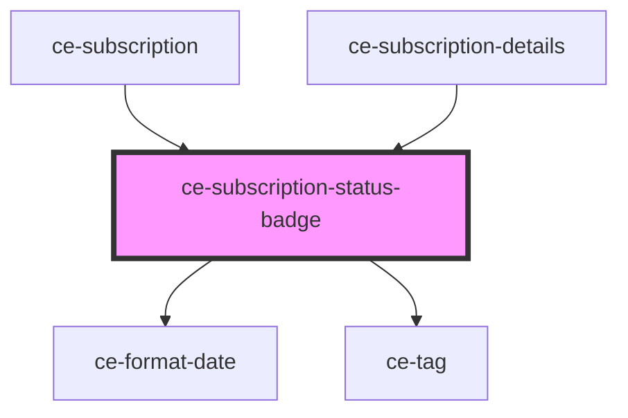

# ce-subscription-status-badge

<!-- Auto Generated Below -->

## Properties

| Property       | Attribute   | Description                                | Type                                                                             | Default     |
| -------------- | ----------- | ------------------------------------------ | -------------------------------------------------------------------------------- | ----------- |
| `clearable`    | `clearable` | Makes the tag clearable.                   | `boolean`                                                                        | `false`     |
| `pill`         | `pill`      | Draws a pill-style tag with rounded edges. | `boolean`                                                                        | `false`     |
| `size`         | `size`      | The tag's size.                            | `"large" \| "medium" \| "small"`                                                 | `'medium'`  |
| `status`       | `status`    | Subscription status                        | `"active" \| "canceled" \| "incomplete" \| "past_due" \| "trialing" \| "unpaid"` | `undefined` |
| `subscription` | --          | The tag's statux type.                     | `Subscription`                                                                   | `undefined` |

## Dependencies

### Used by

 - [ce-subscription](../../controllers/dashboard/subscription)
 - [ce-subscription-details](../../controllers/dashboard/ce-subscription-details)

### Depends on

- [ce-format-date](../../util/format-date)
- [ce-tag](../tag)

### Graph

----------------------------------------------

*Built with [StencilJS](https://stenciljs.com/)*
