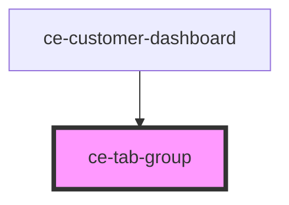

# ce-tab-group

<!-- Auto Generated Below -->

## Events

| Event       | Description | Type                  |
| ----------- | ----------- | --------------------- |
| `ceTabHide` |             | `CustomEvent<string>` |
| `ceTabShow` |             | `CustomEvent<string>` |

## Shadow Parts

| Part                     | Description |
| ------------------------ | ----------- |
| `"active-tab-indicator"` |             |
| `"base"`                 |             |
| `"body"`                 |             |
| `"nav"`                  |             |
| `"tabs"`                 |             |

## Dependencies

### Used by

 - [ce-customer-dashboard](../../controllers/customer-dashboard)

### Graph

----------------------------------------------

*Built with [StencilJS](https://stenciljs.com/)*
