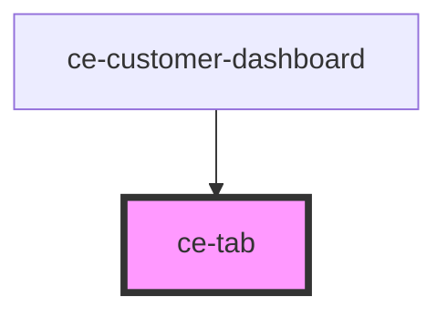

# ce-tab

<!-- Auto Generated Below -->

## Properties

| Property   | Attribute  | Description                                                                                      | Type      | Default     |
| ---------- | ---------- | ------------------------------------------------------------------------------------------------ | --------- | ----------- |
| `active`   | `active`   | Draws the tab in an active state.                                                                | `boolean` | `false`     |
| `count`    | `count`    |                                                                                                  | `string`  | `undefined` |
| `disabled` | `disabled` | Draws the tab in a disabled state.                                                               | `boolean` | `false`     |
| `href`     | `href`     |                                                                                                  | `string`  | `undefined` |
| `panel`    | `panel`    | The name of the tab panel the tab will control. The panel must be located in the same tab group. | `string`  | `''`        |

## Events

| Event     | Description | Type                |
| --------- | ----------- | ------------------- |
| `ceClose` | Close event | `CustomEvent<void>` |

## Methods

### `triggerBlur() => Promise<void>`

Removes focus from the tab.

#### Returns

Type: `Promise<void>`

### `triggerFocus(options?: FocusOptions) => Promise<void>`

Sets focus to the tab.

#### Returns

Type: `Promise<void>`

## Shadow Parts

| Part        | Description |
| ----------- | ----------- |
| `"content"` |             |
| `"counter"` |             |
| `"prefix"`  |             |
| `"suffix"`  |             |

## Dependencies

### Used by

 - [ce-customer-dashboard](../../controllers/dashboard/customer-dashboard)

### Graph

----------------------------------------------

*Built with [StencilJS](https://stenciljs.com/)*
