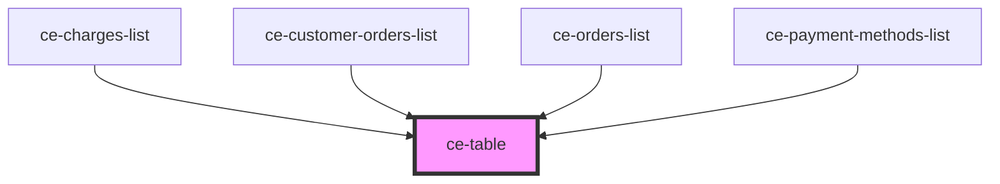

# ce-table

<!-- Auto Generated Below -->

## Dependencies

### Used by

 - [ce-charges-list](../../controllers/dashboard/charges-list)
 - [ce-customer-orders-list](../../controllers/dashboard/customer-orders-list)
 - [ce-orders-list](../../controllers/dashboard/orders-list)
 - [ce-payment-methods-list](../../controllers/dashboard/payment-methods-list)

### Graph

----------------------------------------------

*Built with [StencilJS](https://stenciljs.com/)*
