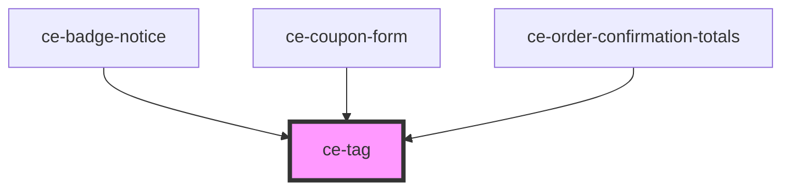

# ce-tag

<!-- Auto Generated Below -->

## Properties

| Property    | Attribute   | Description                                | Type                                                                  | Default     |
| ----------- | ----------- | ------------------------------------------ | --------------------------------------------------------------------- | ----------- |
| `clearable` | `clearable` | Makes the tag clearable.                   | `boolean`                                                             | `false`     |
| `pill`      | `pill`      | Draws a pill-style tag with rounded edges. | `boolean`                                                             | `false`     |
| `size`      | `size`      | The tag's size.                            | `"large" \| "medium" \| "small"`                                      | `'medium'`  |
| `type`      | `type`      | The tag's type.                            | `"danger" \| "info" \| "primary" \| "success" \| "text" \| "warning"` | `undefined` |

## Events

| Event     | Description | Type                 |
| --------- | ----------- | -------------------- |
| `ceClear` |             | `CustomEvent<CeTag>` |

## Shadow Parts

| Part        | Description |
| ----------- | ----------- |
| `"base"`    |             |
| `"content"` |             |

## Dependencies

### Used by

 - [ce-badge-notice](../badge-notice)
 - [ce-coupon-form](../../controllers/coupon-form)
 - [ce-order-confirmation-totals](../../controllers/order-confirmation-totals)

### Graph

----------------------------------------------

*Built with [StencilJS](https://stenciljs.com/)*
