# ce-tag

<!-- Auto Generated Below -->

## Properties

| Property    | Attribute   | Description                                | Type                                                                     | Default     |
| ----------- | ----------- | ------------------------------------------ | ------------------------------------------------------------------------ | ----------- |
| `clearable` | `clearable` | Makes the tag clearable.                   | `boolean`                                                                | `false`     |
| `pill`      | `pill`      | Draws a pill-style tag with rounded edges. | `boolean`                                                                | `false`     |
| `size`      | `size`      | The tag's size.                            | `"large" \| "medium" \| "small"`                                         | `'medium'`  |
| `type`      | `type`      | The tag's type.                            | `"danger" \| "default" \| "info" \| "primary" \| "success" \| "warning"` | `'default'` |

## Events

| Event     | Description | Type                 |
| --------- | ----------- | -------------------- |
| `scClear` |             | `CustomEvent<ScTag>` |

## Shadow Parts

| Part        | Description |
| ----------- | ----------- |
| `"base"`    |             |
| `"content"` |             |

## Dependencies

### Used by

 - [sc-badge-notice](../badge-notice)
 - [sc-cart-header](../../controllers/cart/cart-header)
 - [sc-charges-list](../../controllers/dashboard/charges-list)
 - [sc-coupon-form](../coupon-form)
 - [sc-customer-details](../customer-details)
 - [sc-customer-edit](../../controllers/dashboard/customer-edit)
 - [sc-downloads-list](../../controllers/dashboard/sc-downloads-list)
 - [sc-invoices-list](../../controllers/dashboard/invoices-list)
 - [sc-licenses-list](../../controllers/dashboard/sc-licenses-list)
 - [sc-order](../../controllers/dashboard/order)
 - [sc-order-confirmation-details](../../controllers/confirmation/order-confirmation-details)
 - [sc-order-confirmation-totals](../../controllers/confirmation/order-confirmation-totals)
 - [sc-order-status-badge](../order-status-badge)
 - [sc-orders-list](../../controllers/dashboard/orders-list)
 - [sc-payment](../../controllers/checkout-form/payment)
 - [sc-payment-method](../sc-payment-method)
 - [sc-payment-methods-list](../../controllers/dashboard/payment-methods-list)
 - [sc-subscription-details](../../controllers/dashboard/subscription-details)
 - [sc-subscription-payment-method](../../controllers/dashboard/sc-subscription-payment-method)
 - [sc-subscription-status-badge](../subscription-status-badge)
 - [sc-subscription-switch](../../controllers/dashboard/subscription-switch)

### Graph

```mermaid
graph TD;
  sc-badge-notice --> sc-tag
  sc-cart-header --> sc-tag
  sc-charges-list --> sc-tag
  sc-coupon-form --> sc-tag
  sc-customer-details --> sc-tag
  sc-customer-edit --> sc-tag
  sc-downloads-list --> sc-tag
  sc-invoices-list --> sc-tag
  sc-licenses-list --> sc-tag
  sc-order --> sc-tag
  sc-order-confirmation-details --> sc-tag
  sc-order-confirmation-totals --> sc-tag
  sc-order-status-badge --> sc-tag
  sc-orders-list --> sc-tag
  sc-payment --> sc-tag
  sc-payment-method --> sc-tag
  sc-payment-methods-list --> sc-tag
  sc-subscription-details --> sc-tag
  sc-subscription-payment-method --> sc-tag
  sc-subscription-status-badge --> sc-tag
  sc-subscription-switch --> sc-tag
  style sc-tag fill:#f9f,stroke:#333,stroke-width:4px
```

----------------------------------------------

*Built with [StencilJS](https://stenciljs.com/)*
