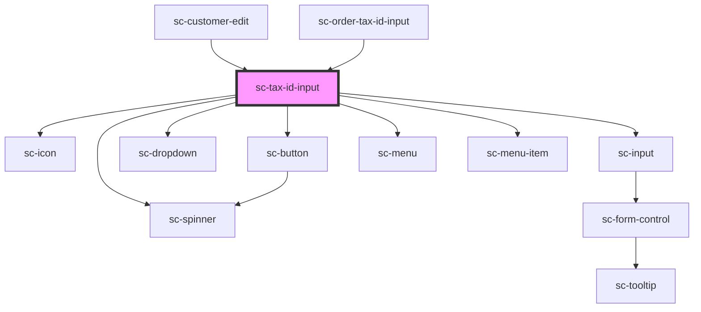

# ce-tax-id-input

<!-- Auto Generated Below -->

## Properties

| Property  | Attribute | Description           | Type                                | Default     |
| --------- | --------- | --------------------- | ----------------------------------- | ----------- |
| `country` | `country` | The country code.     | `string`                            | `undefined` |
| `help`    | `help`    | Help text.            | `string`                            | `undefined` |
| `loading` | `loading` | Is this loading?      | `boolean`                           | `undefined` |
| `number`  | `number`  | Tax ID Number         | `string`                            | `null`      |
| `show`    | `show`    | Force show the field. | `boolean`                           | `false`     |
| `status`  | `status`  | The status            | `"invalid" \| "unknown" \| "valid"` | `'unknown'` |
| `type`    | `type`    | Type of tax id        | `string`                            | `'other'`   |

## Events

| Event         | Description                         | Type                                                      |
| ------------- | ----------------------------------- | --------------------------------------------------------- |
| `scChange`    | Make a request to update the order. | `CustomEvent<{ number: string; number_type: string; }>`   |
| `scInput`     | Make a request to update the order. | `CustomEvent<{ number?: string; number_type?: string; }>` |
| `scInputType` | Change the Type                     | `CustomEvent<string>`                                     |
| `scSetState`  | Set the checkout state.             | `CustomEvent<string>`                                     |

## Dependencies

### Used by

 - [sc-customer-edit](../../controllers/dashboard/customer-edit)
 - [sc-order-tax-id-input](../../controllers/checkout-form/order-tax-id-input)

### Depends on

- [sc-icon](../icon)
- [sc-input](../input)
- [sc-spinner](../spinner)
- [sc-dropdown](../dropdown)
- [sc-button](../button)
- [sc-menu](../menu)
- [sc-menu-item](../menu-item)

### Graph

----------------------------------------------

*Built with [StencilJS](https://stenciljs.com/)*
