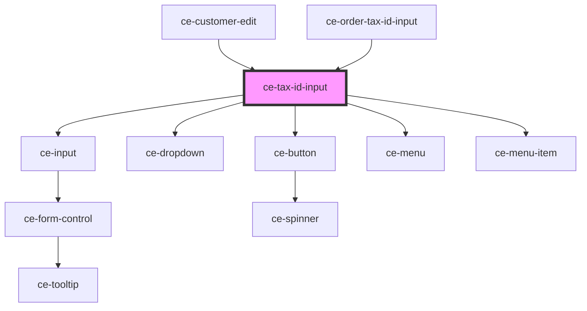

# ce-tax-id-input

<!-- Auto Generated Below -->

## Properties

| Property  | Attribute | Description           | Type      | Default     |
| --------- | --------- | --------------------- | --------- | ----------- |
| `country` | `country` | Label for the field.  | `string`  | `undefined` |
| `number`  | `number`  | Tax ID Number         | `string`  | `null`      |
| `show`    | `show`    | Force show the field. | `boolean` | `false`     |
| `type`    | `type`    | Type of tax id        | `string`  | `null`      |

## Events

| Event        | Description                         | Type                                                    |
| ------------ | ----------------------------------- | ------------------------------------------------------- |
| `ceChange`   | Make a request to update the order. | `CustomEvent<{ number: string; number_type: string; }>` |
| `ceSetState` | Set the checkout state.             | `CustomEvent<string>`                                   |

## Dependencies

### Used by

 - [ce-customer-edit](../../controllers/dashboard/customer-edit)
 - [ce-order-tax-id-input](../../controllers/checkout-form/order-tax-id-input)

### Depends on

- [ce-input](../input)
- [ce-dropdown](../dropdown)
- [ce-button](../button)
- [ce-menu](../menu)
- [ce-menu-item](../menu-item)

### Graph

----------------------------------------------

*Built with [StencilJS](https://stenciljs.com/)*
