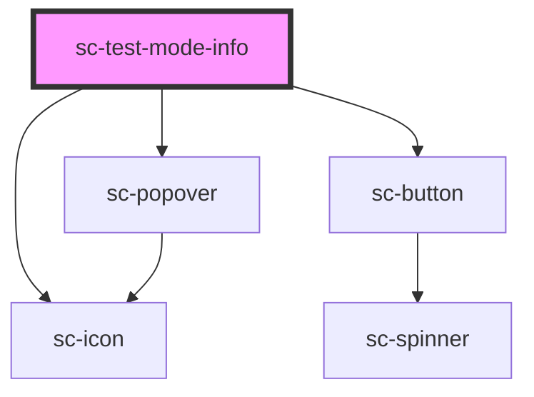

# sc-test-mode-info

<!-- Auto Generated Below -->

## Shadow Parts

| Part        | Description                |
| ----------- | -------------------------- |
| `"base"`    | The elements base wrapper. |
| `"panel"`   | The panel.                 |
| `"trigger"` | The trigger.               |

## Dependencies

### Depends on

- [sc-popover](../popover)
- [sc-button](../button)
- [sc-icon](../icon)

### Graph

----------------------------------------------

*Built with [StencilJS](https://stenciljs.com/)*
