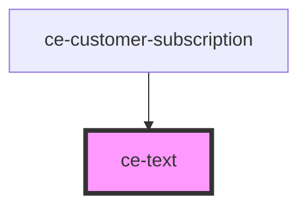

# ce-text

<!-- Auto Generated Below -->

## Properties

| Property   | Attribute  | Description | Type                                                  | Default |
| ---------- | ---------- | ----------- | ----------------------------------------------------- | ------- |
| `tag`      | `tag`      |             | `"h1" \| "h2" \| "h3" \| "h4" \| "h5" \| "h6" \| "p"` | `'p'`   |
| `truncate` | `truncate` |             | `boolean`                                             | `false` |

## Dependencies

### Used by

 - [ce-customer-subscription](../../controllers/dashboard/customer-subscription)

### Graph

----------------------------------------------

*Built with [StencilJS](https://stenciljs.com/)*
