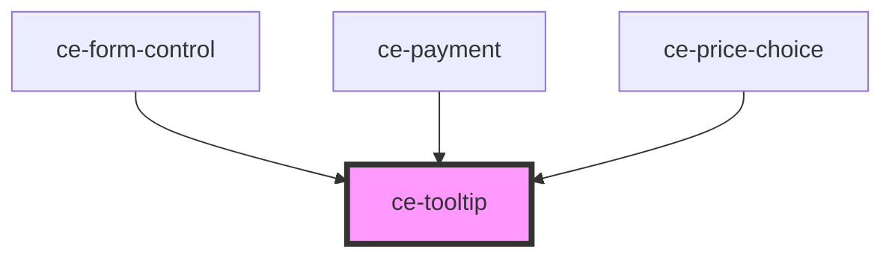

# ce-tooltip

<!-- Auto Generated Below -->

## Properties

| Property  | Attribute | Description            | Type                                                                  | Default     |
| --------- | --------- | ---------------------- | --------------------------------------------------------------------- | ----------- |
| `freeze`  | `freeze`  | Freeze open or closed. | `boolean`                                                             | `undefined` |
| `open`    | `open`    | Open or not            | `boolean`                                                             | `undefined` |
| `padding` | `padding` | The tooltip's padding. | `number`                                                              | `5`         |
| `text`    | `text`    | Tooltip text           | `string`                                                              | `undefined` |
| `type`    | `type`    | The tooltip's type.    | `"danger" \| "info" \| "primary" \| "success" \| "text" \| "warning"` | `'info'`    |
| `width`   | `width`   | Tooltip fixed width    | `string`                                                              | `undefined` |

## Shadow Parts

| Part     | Description |
| -------- | ----------- |
| `"base"` |             |
| `"text"` |             |

## Dependencies

### Used by

 - [ce-form-control](../form-control)
 - [ce-payment](../../controllers/checkout-form/payment)
 - [ce-price-choice](../../controllers/checkout-form/price-choice)

### Graph

----------------------------------------------

*Built with [StencilJS](https://stenciljs.com/)*
