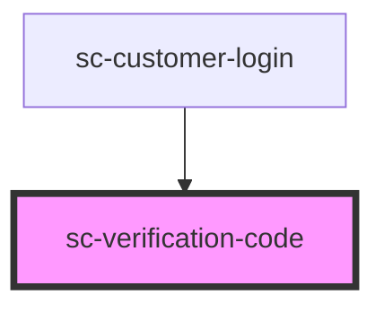

# sc-verification-code

<!-- Auto Generated Below -->

## Properties

| Property   | Attribute | Description                                           | Type                      | Default     |
| ---------- | --------- | ----------------------------------------------------- | ------------------------- | ----------- |
| `loading`  | `loading` | Whether the component is in a loading/verifying state | `boolean`                 | `false`     |
| `onChange` | --        | On change verification code                           | `(value: string) => void` | `undefined` |
| `total`    | `total`   | Total number of inputs                                | `number`                  | `6`         |

## Methods

### `triggerFocus() => Promise<void>`

Focus the first code input.

#### Returns

Type: `Promise<void>`

## Dependencies

### Used by

 - [sc-customer-login](../../controllers/checkout-form/customer-login)

### Graph

----------------------------------------------

*Built with [StencilJS](https://stenciljs.com/)*
