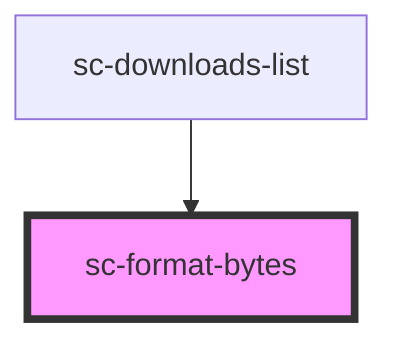

# ce-format-bytes

<!-- Auto Generated Below -->

## Properties

| Property  | Attribute | Description                                                                 | Type                            | Default     |
| --------- | --------- | --------------------------------------------------------------------------- | ------------------------------- | ----------- |
| `display` | `display` | Determines how to display the result, e.g. "100 bytes", "100 b", or "100b". | `"long" \| "narrow" \| "short"` | `'short'`   |
| `locale`  | `locale`  | The locale to use when formatting the number.                               | `string`                        | `undefined` |
| `unit`    | `unit`    | The unit to display.                                                        | `"bit" \| "byte"`               | `'byte'`    |
| `value`   | `value`   | The number to format in bytes.                                              | `number`                        | `0`         |

## Dependencies

### Used by

 - [sc-downloads-list](../../ui/downloads-list)

### Graph

----------------------------------------------

*Built with [StencilJS](https://stenciljs.com/)*
