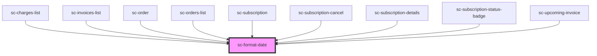

# ce-format-date

<!-- Auto Generated Below -->

## Properties

| Property       | Attribute        | Description                                                                  | Type                                                      | Default      |
| -------------- | ---------------- | ---------------------------------------------------------------------------- | --------------------------------------------------------- | ------------ |
| `date`         | `date`           | The date/time to format. If not set, the current date and time will be used. | `Date \| number \| string`                                | `new Date()` |
| `day`          | `day`            | The format for displaying the day.                                           | `"2-digit" \| "numeric"`                                  | `undefined`  |
| `era`          | `era`            | The format for displaying the era.                                           | `"long" \| "narrow" \| "short"`                           | `undefined`  |
| `hour`         | `hour`           | The format for displaying the hour.                                          | `"2-digit" \| "numeric"`                                  | `undefined`  |
| `hourFormat`   | `hour-format`    | When set, 24 hour time will always be used.                                  | `"12" \| "24" \| "auto"`                                  | `'auto'`     |
| `locale`       | `locale`         | The locale to use when formatting the date/time.                             | `string`                                                  | `undefined`  |
| `minute`       | `minute`         | The format for displaying the minute.                                        | `"2-digit" \| "numeric"`                                  | `undefined`  |
| `month`        | `month`          | The format for displaying the month.                                         | `"2-digit" \| "long" \| "narrow" \| "numeric" \| "short"` | `undefined`  |
| `second`       | `second`         | The format for displaying the second.                                        | `"2-digit" \| "numeric"`                                  | `undefined`  |
| `timeZone`     | `time-zone`      | The time zone to express the time in.                                        | `string`                                                  | `undefined`  |
| `timeZoneName` | `time-zone-name` | The format for displaying the time.                                          | `"long" \| "short"`                                       | `undefined`  |
| `type`         | `type`           |                                                                              | `"date" \| "timestamp"`                                   | `'date'`     |
| `weekday`      | `weekday`        | The format for displaying the weekday.                                       | `"long" \| "narrow" \| "short"`                           | `undefined`  |
| `year`         | `year`           | The format for displaying the year.                                          | `"2-digit" \| "numeric"`                                  | `undefined`  |

## Dependencies

### Used by

 - [sc-charges-list](../../controllers/dashboard/charges-list)
 - [sc-invoices-list](../../controllers/dashboard/invoices-list)
 - [sc-order](../../controllers/dashboard/order)
 - [sc-orders-list](../../controllers/dashboard/orders-list)
 - [sc-subscription](../../controllers/dashboard/subscription)
 - [sc-subscription-cancel](../../controllers/dashboard/subscription-cancel)
 - [sc-subscription-details](../../controllers/dashboard/subscription-details)
 - [sc-subscription-status-badge](../../ui/subscription-status-badge)
 - [sc-upcoming-invoice](../../controllers/dashboard/upcoming-invoice)

### Graph

----------------------------------------------

*Built with [StencilJS](https://stenciljs.com/)*
