# ce-format-number

<!-- Auto Generated Below -->

## Properties

| Property                   | Attribute                    | Description                                                                                    | Type                                             | Default     |
| -------------------------- | ---------------------------- | ---------------------------------------------------------------------------------------------- | ------------------------------------------------ | ----------- |
| `currency`                 | `currency`                   | The currency to use when formatting. Must be an ISO 4217 currency code such as `USD` or `EUR`. | `string`                                         | `'USD'`     |
| `currencyDisplay`          | `currency-display`           | How to display the currency.                                                                   | `"code" \| "name" \| "narrowSymbol" \| "symbol"` | `'symbol'`  |
| `locale`                   | `locale`                     | The locale to use when formatting the number.                                                  | `string`                                         | `undefined` |
| `maximumFractionDigits`    | `maximum-fraction-digits`    | The maximum number of fraction digits to use. Possible values are 0 - 20.                      | `number`                                         | `undefined` |
| `maximumSignificantDigits` | `maximum-significant-digits` | The maximum number of significant digits to use,. Possible values are 1 - 21.                  | `number`                                         | `undefined` |
| `minimumFractionDigits`    | `minimum-fraction-digits`    | The minimum number of fraction digits to use. Possible values are 0 - 20.                      | `number`                                         | `null`      |
| `minimumIntegerDigits`     | `minimum-integer-digits`     | The minimum number of integer digits to use. Possible values are 1 - 21.                       | `number`                                         | `undefined` |
| `minimumSignificantDigits` | `minimum-significant-digits` | The minimum number of significant digits to use. Possible values are 1 - 21.                   | `number`                                         | `undefined` |
| `noConvert`                | `no-convert`                 | Should we convert                                                                              | `boolean`                                        | `undefined` |
| `noGrouping`               | `no-grouping`                | Turns off grouping separators.                                                                 | `boolean`                                        | `false`     |
| `type`                     | `type`                       | The formatting style to use.                                                                   | `"currency" \| "decimal" \| "percent" \| "unit"` | `'decimal'` |
| `unit`                     | `unit`                       | The unit to use when formatting.                                                               | `string`                                         | `'lb'`      |
| `value`                    | `value`                      | The number to format.                                                                          | `number`                                         | `0`         |

## Dependencies

### Used by

 - [sc-charges-list](../../controllers/dashboard/charges-list)
 - [sc-coupon-form](../../ui/coupon-form)
 - [sc-fulfillments](../../controllers/dashboard/fulfillments)
 - [sc-invoices-list](../../controllers/dashboard/invoices-list)
 - [sc-line-item-bump](../../controllers/checkout-form/sc-line-item-bump)
 - [sc-line-item-shipping](../../controllers/checkout-form/sc-line-item-shipping)
 - [sc-line-item-tax](../../controllers/checkout-form/line-item-tax)
 - [sc-line-item-total](../../controllers/checkout-form/line-item-total)
 - [sc-line-item-trial](../../controllers/checkout-form/line-item-trial)
 - [sc-order](../../controllers/dashboard/order)
 - [sc-order-bump](../../controllers/checkout-form/sc-order-bump)
 - [sc-order-confirmation-totals](../../controllers/confirmation/order-confirmation-totals)
 - [sc-order-detail](../../controllers/confirmation/order-detail)
 - [sc-order-summary](../../controllers/checkout-form/order-summary)
 - [sc-orders-list](../../controllers/dashboard/orders-list)
 - [sc-price](../../ui/price)
 - [sc-price-choice](../../controllers/checkout-form/price-choice)
 - [sc-price-choice-container](../../ui/sc-price-choice-container)
 - [sc-price-range](../../ui/sc-price-range)
 - [sc-product-donation-amount-choice](../../controllers/checkout-form/product-donation-amount-choice)
 - [sc-product-item-price](../../controllers/products/sc-product-item-price)
 - [sc-product-line-item](../../ui/product-line-item)
 - [sc-product-price-choices](../../controllers/product/sc-product-price-choices)
 - [sc-product-selected-price](../../controllers/checkout-form/sc-product-selected-price)
 - [sc-recurring-price-choice-container](../../ui/sc-recurring-price-choice-container)
 - [sc-shipping-choices](../../ui/sc-shipping-choices)
 - [sc-subscription-details](../../controllers/dashboard/subscription-details)
 - [sc-subscription-next-payment](../../controllers/dashboard/subscription-details)
 - [sc-subscription-reactivate](../../controllers/dashboard/subscription-reactivate)
 - [sc-subscription-switch](../../controllers/dashboard/subscription-switch)
 - [sc-total](../../controllers/checkout-form/total)
 - [sc-upcoming-invoice](../../controllers/dashboard/upcoming-invoice)
 - [sc-upsell-totals](../../controllers/upsell/sc-upsell-totals)

### Graph

```mermaid
graph TD;
  sc-charges-list --> sc-format-number
  sc-coupon-form --> sc-format-number
  sc-fulfillments --> sc-format-number
  sc-invoices-list --> sc-format-number
  sc-line-item-bump --> sc-format-number
  sc-line-item-shipping --> sc-format-number
  sc-line-item-tax --> sc-format-number
  sc-line-item-total --> sc-format-number
  sc-line-item-trial --> sc-format-number
  sc-order --> sc-format-number
  sc-order-bump --> sc-format-number
  sc-order-confirmation-totals --> sc-format-number
  sc-order-detail --> sc-format-number
  sc-order-summary --> sc-format-number
  sc-orders-list --> sc-format-number
  sc-price --> sc-format-number
  sc-price-choice --> sc-format-number
  sc-price-choice-container --> sc-format-number
  sc-price-range --> sc-format-number
  sc-product-donation-amount-choice --> sc-format-number
  sc-product-item-price --> sc-format-number
  sc-product-line-item --> sc-format-number
  sc-product-price-choices --> sc-format-number
  sc-product-selected-price --> sc-format-number
  sc-recurring-price-choice-container --> sc-format-number
  sc-shipping-choices --> sc-format-number
  sc-subscription-details --> sc-format-number
  sc-subscription-next-payment --> sc-format-number
  sc-subscription-reactivate --> sc-format-number
  sc-subscription-switch --> sc-format-number
  sc-total --> sc-format-number
  sc-upcoming-invoice --> sc-format-number
  sc-upsell-totals --> sc-format-number
  style sc-format-number fill:#f9f,stroke:#333,stroke-width:4px
```

----------------------------------------------

*Built with [StencilJS](https://stenciljs.com/)*
