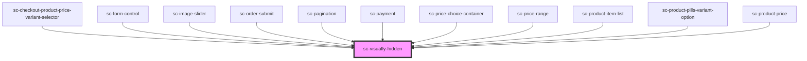

# sc-visually-hidden

<!-- Auto Generated Below -->

## Dependencies

### Used by

 - [sc-checkout-product-price-variant-selector](../../controllers/checkout-form/sc-checkout-product-price-variant-selector)
 - [sc-form-control](../../ui/form-control)
 - [sc-image-slider](../../ui/sc-image-slider)
 - [sc-order-submit](../../controllers/checkout-form/order-submit)
 - [sc-pagination](../../ui/pagination)
 - [sc-payment](../../controllers/checkout-form/payment)
 - [sc-price-choice-container](../../ui/sc-price-choice-container)
 - [sc-price-range](../../ui/sc-price-range)
 - [sc-product-item-list](../../controllers/products/sc-product-item-list)
 - [sc-product-pills-variant-option](../../controllers/product/sc-product-pills-variant-option)
 - [sc-product-price](../../controllers/product/sc-product-price)

### Graph

----------------------------------------------

*Built with [StencilJS](https://stenciljs.com/)*
