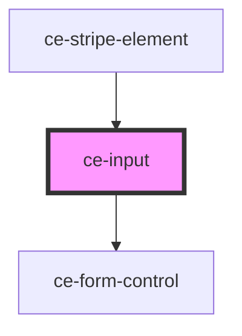

# Input

```html
<ce-input-button></ce-input-button>
```

Inputs collect data from the user.

import DemoTabs from '../../components/Demo-Tabs.js';

<DemoTabs>
	<DemoTabs.Code>
		{ `
<ce-input></ce-input>
` }
	</DemoTabs.Code>
	<ce-input></ce-input>
</DemoTabs>

### Placeholder

<DemoTabs>
	<DemoTabs.Code>
		{ `
<ce-input placeholder="Enter your name"></ce-input>
` }
	</DemoTabs.Code>
	<ce-input placeholder="Enter your name"></ce-input>
</DemoTabs>

### Clearable

<DemoTabs>
	<DemoTabs.Code>
		{ `
<ce-input placeholder="Clearable" clearable></ce-input>
` }
	</DemoTabs.Code>
	<ce-input placeholder="Clearable" clearable></ce-input>
</DemoTabs>

### Disabled

<DemoTabs>
	<DemoTabs.Code>
		{ `
<ce-input placeholder="Disabled" disabled></ce-input>
` }
	</DemoTabs.Code>
	<ce-input placeholder="Disabled" disabled></ce-input>
</DemoTabs>

### Sizes

<DemoTabs>
	<DemoTabs.Code>
		{ `
<ce-input placeholder="Small" size="small"></ce-input>
<ce-input placeholder="Medium" size="medium"></ce-input>
<ce-input placeholder="Large" size="large"></ce-input>
` }
	</DemoTabs.Code>
	<ce-input placeholder="Small" size="small"></ce-input>
	<br />
	<ce-input placeholder="Medium" size="medium"></ce-input>
	<br />
	<ce-input placeholder="Large" size="large"></ce-input>
</DemoTabs>

### Prefix and Suffix

<DemoTabs>
	<DemoTabs.Code>
		{ `
<ce-input placeholder="Small" size="small">
    <span slot="prefix">👍🏻</span>
    <span slot="suffix">👍🏻</span>
</ce-input>
<ce-input placeholder="Medium" size="medium">
    <span slot="prefix">👍🏻</span>
    <span slot="suffix">👍🏻</span>
</ce-input>
<ce-input placeholder="Large" size="large">
    <span slot="prefix">👍🏻</span>
    <span slot="suffix">👍🏻</span>
</ce-input>
` }
	</DemoTabs.Code>
	<ce-input placeholder="Small" size="small">
		<span slot="prefix">👍🏻</span>
		<span slot="suffix">👍🏻</span>
	</ce-input>
	<br />
	<ce-input placeholder="Medium" size="medium">
		<span slot="prefix">👍🏻</span>
		<span slot="suffix">👍🏻</span>
	</ce-input>
	<br />
	<ce-input placeholder="Large" size="large">
		<span slot="prefix">👍🏻</span>
		<span slot="suffix">👍🏻</span>
	</ce-input>
</DemoTabs>

### Labels

<DemoTabs>
	<DemoTabs.Code>
		{ `
<ce-input label="What is your name"></ce-input>
` }
	</DemoTabs.Code>
	<ce-input label="What is your name"></ce-input>
</DemoTabs>

### Help Text

<DemoTabs>
	<DemoTabs.Code>
		{ `
<ce-input label="What is your name"></ce-input>
` }
	</DemoTabs.Code>
	<ce-input
		label="What is your name"
		help="If you can't remember your name, make one up!"
	></ce-input>
</DemoTabs>

<!-- Auto Generated Below -->

## Properties

| Property         | Attribute         | Description                                                                                                                                                                                                   | Type                                                                                  | Default     |
| ---------------- | ----------------- | ------------------------------------------------------------------------------------------------------------------------------------------------------------------------------------------------------------- | ------------------------------------------------------------------------------------- | ----------- |
| `autocomplete`   | `autocomplete`    | The input's autocomplete attribute.                                                                                                                                                                           | `string`                                                                              | `undefined` |
| `autocorrect`    | `autocorrect`     | The input's autocorrect attribute.                                                                                                                                                                            | `string`                                                                              | `undefined` |
| `autofocus`      | `autofocus`       | The input's autofocus attribute.                                                                                                                                                                              | `boolean`                                                                             | `undefined` |
| `clearable`      | `clearable`       | Adds a clear button when the input is populated.                                                                                                                                                              | `boolean`                                                                             | `false`     |
| `disabled`       | `disabled`        | Disables the input.                                                                                                                                                                                           | `boolean`                                                                             | `false`     |
| `hasFocus`       | `has-focus`       | Inputs focus                                                                                                                                                                                                  | `boolean`                                                                             | `undefined` |
| `help`           | `help`            | The input's help text.                                                                                                                                                                                        | `string`                                                                              | `''`        |
| `inputmode`      | `inputmode`       | The input's inputmode attribute.                                                                                                                                                                              | `"decimal" \| "email" \| "none" \| "numeric" \| "search" \| "tel" \| "text" \| "url"` | `undefined` |
| `invalid`        | `invalid`         | This will be true when the control is in an invalid state. Validity is determined by props such as `type`, `required`, `minlength`, `maxlength`, and `pattern` using the browser's constraint validation API. | `boolean`                                                                             | `false`     |
| `label`          | `label`           | The input's label.                                                                                                                                                                                            | `string`                                                                              | `undefined` |
| `max`            | `max`             | The input's maximum value.                                                                                                                                                                                    | `number \| string`                                                                    | `undefined` |
| `maxlength`      | `maxlength`       | The maximum length of input that will be considered valid.                                                                                                                                                    | `number`                                                                              | `undefined` |
| `min`            | `min`             | The input's minimum value.                                                                                                                                                                                    | `number \| string`                                                                    | `undefined` |
| `minlength`      | `minlength`       | The minimum length of input that will be considered valid.                                                                                                                                                    | `number`                                                                              | `undefined` |
| `name`           | `name`            | The input's name attribute.                                                                                                                                                                                   | `string`                                                                              | `undefined` |
| `pattern`        | `pattern`         | A pattern to validate input against.                                                                                                                                                                          | `string`                                                                              | `undefined` |
| `pill`           | `pill`            | Draws a pill-style input with rounded edges.                                                                                                                                                                  | `boolean`                                                                             | `false`     |
| `placeholder`    | `placeholder`     | The input's placeholder text.                                                                                                                                                                                 | `string`                                                                              | `undefined` |
| `readonly`       | `readonly`        | Makes the input readonly.                                                                                                                                                                                     | `boolean`                                                                             | `false`     |
| `required`       | `required`        | Makes the input a required field.                                                                                                                                                                             | `boolean`                                                                             | `false`     |
| `showLabel`      | `show-label`      | Should we show the label                                                                                                                                                                                      | `boolean`                                                                             | `true`      |
| `size`           | `size`            | The input's size.                                                                                                                                                                                             | `"large" \| "medium" \| "small"`                                                      | `'medium'`  |
| `spellcheck`     | `spellcheck`      | Enables spell checking on the input.                                                                                                                                                                          | `boolean`                                                                             | `undefined` |
| `step`           | `step`            | The input's step attribute.                                                                                                                                                                                   | `number`                                                                              | `undefined` |
| `togglePassword` | `toggle-password` | Adds a password toggle button to password inputs.                                                                                                                                                             | `boolean`                                                                             | `false`     |
| `type`           | `type`            | The input's type.                                                                                                                                                                                             | `"email" \| "number" \| "password" \| "search" \| "tel" \| "text" \| "url"`           | `'text'`    |
| `value`          | `value`           | The input's value attribute.                                                                                                                                                                                  | `string`                                                                              | `''`        |

## Events

| Event          | Description                                 | Type                |
| -------------- | ------------------------------------------- | ------------------- |
| `prestoBlur`   | Emitted when the control loses focus.       | `CustomEvent<void>` |
| `prestoChange` | Emitted when the control's value changes.   | `CustomEvent<void>` |
| `prestoClear`  | Emitted when the clear button is activated. | `CustomEvent<void>` |
| `prestoFocus`  | Emitted when the control gains focus.       | `CustomEvent<void>` |
| `prestoInput`  | Emitted when the control receives input.    | `CustomEvent<void>` |

## Methods

### `reportValidity() => Promise<boolean>`

#### Returns

Type: `Promise<boolean>`

### `setBlur() => Promise<void>`

Removes focus from the input.

#### Returns

Type: `Promise<void>`

### `setFocus(options?: FocusOptions) => Promise<void>`

Sets focus on the input.

#### Returns

Type: `Promise<void>`

## Shadow Parts

| Part          | Description                                      |
| ------------- | ------------------------------------------------ |
| `"base"`      | The elements base wrapper.                       |
| `"help-text"` | Help text that describes how to use the input.   |
| `"input"`     | The html input element.                          |
| `"prefix"`    | Used to prepend an icon or element to the input. |
| `"suffix"`    | Used to prepend an icon or element to the input. |

## Dependencies

### Used by

-   [ce-stripe-element](../stripe-element)

### Depends on

-   [ce-form-control](../form-control)

### Graph



---

_Built with [StencilJS](https://stenciljs.com/)_
